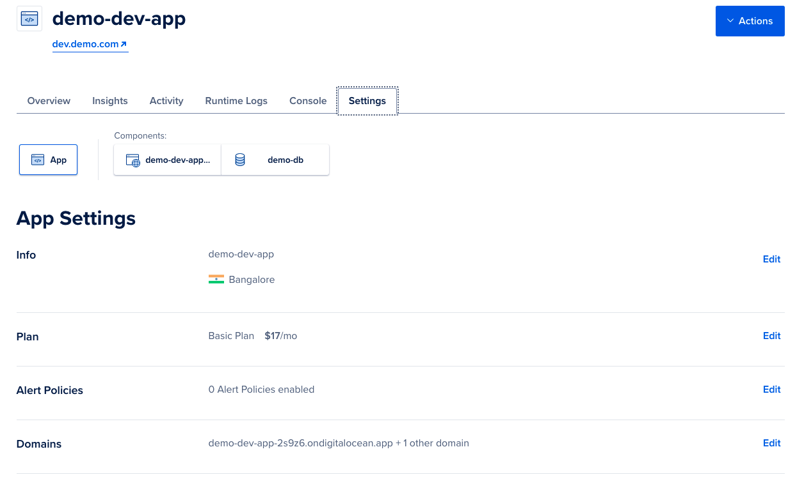

# Spring Boot DigitalOcean App Platform Demo

This repository showcases an opinionated deployment of a sample Spring boot application
right from GitHub source to DigitalOcean App Platform using:

- **Maven**    - Build and package the sample Spring Boot application into a fat jar

- **GitHub Actions**  - Trigger a build on code commit which in turn builds, test and
  creates a docker image using the Dockerfile. The image is pushed to DigitalOcean
  container registry and finally deployed to App Platform using Terraform.

- **Terraform**      - Manage infrastructure on DigitalOcean

## Overview

The following diagram depicts the opinionated pipeline built using Github Actions


- Run `./mvnw clean package` is used to test and build the Spring Boot fat JAR
- Run `docker build` creates a docker image of the fat JAR using the Dockerfile in the repo
- Run `doctl` CLI is used to push the built image to DigitalOcean Container Registry. A secret
  is created in GitHub Actions as `DO_TOKEN` which holds the DigitalOcean API token. The
  image is tagged using the first 7 characters of the GitHub SHA
- Run `terraform apply` is run targeting the App platform instance to deploy the app using the
  docker image built in the previous step

## Spring Boot App

The Spring boot app is a very simply app that uses Spring Data JPA to implement JPA
repositories. There are two endpoints GET `/api/customer` and POST `/api/customer` to get
all customers stored in the database and create a customer respectively

To run the app locally

- Run the app

  ```shell
  ./mvnw spring-boot:run  
  ```

Note: The application uses H2 memory database and creates the table during startup

## Terraform

The `terraform` directory includes the script to manage the following infrastructure

| Service                         | Usage                                                         |
|---------------------------------|---------------------------------------------------------------|
| DigitalOcean App Platform       | PaaS platform to run the Spring Boot application as a service |
| DigitalOcean Managed Database   | PostgresSQL Database for the application                      |
| DigitalOcean Container Registry | Store build images of the application.                        |

Note: A DigitalOcean spaces bucket has to be created manually as a pre-requisite to store
the Terraform state information. Also generate the Spaces key and secret as
described [here](https://www.digitalocean.com/community/tutorials/how-to-create-a-digitalocean-space-and-api-key)
Open the Digital Ocean web console and navigate to 'Spaces' and create a bucket with the
name `demo-terraform-state-config`. The region should be `sgp1` (Singapore)

### Considerations

- Get the Digital Ocean API token from the console as
  described [here](https://docs.digitalocean.com/reference/api/create-personal-access-token/)
- Use Terraform workspaces to manage multiple environments like `dev`,`qa`,`prod`. Each of
  these environments have different requirements of resource capacity such as CPU, memory
  which are configured in Terraform
- Use the DigitalOcean 'Development database' in the Development environment. The '
  Development database' is a low resource instance and is not suitable for production
  workloads
- Database cluster only accepts connection from the app platform for each environment (
  Trusted Sources). Firewall rules are place to block all other traffic

### Execution

All commands to be run from inside the `terraform` folder

- Export the Digital Ocean API token as

   ```
   export DO_TOKEN=<>
   export DO_SPACES_ACCESS_KEY=<>
   export DO_SPACES_SECRET=<>
   ```

- Run Terraform initialization

  ```
  terraform init \
    -backend-config="access_key=$DO_SPACES_ACCESS_KEY" \
    -backend-config="secret_key=$DO_SPACES_SECRET"
  ```

- Create a new workspace `dev`

  ```
  terraform workspace new dev
  ```

  Terraform should automatically select the `dev` environment. All commands will now be
  executed in the `dev` workspace

- Create the Docker registry only once. Note the Docker registry must be created before
  running the CI pipeline as the pipeline uploads the docker images to this registry

  ```
  terraform apply -target=digitalocean_container_registry.demo-docr -var="do_token=$DO_TOKEN" 
  ```

- To verify the changes do the infrastructure. Ensure you are in the right workspace

   ```
   terraform plan -var="do_token=$DO_TOKEN" 
   ```

- To commit the infrastructure changes on the `dev` workspace. Ensure you are in the right
  workspace

  ```
  terraform apply -var="do_token=$DO_TOKEN" 
  ```

### Access

Once the application has been successfully deployed onto the App platform, navigate to the
App Platform section in DigitalOcean to get the live url. Note that we do create a custom
domain as `dev.demo.com` as a sample to showcase custom domains. Sample screenshot attached below



